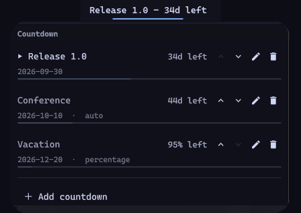
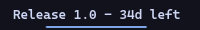
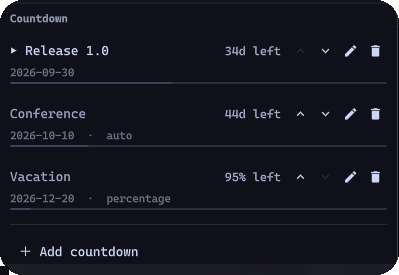

<h1 align="center">Countdown</h1>

<p align="center">
  Countdowns for the <a href="https://omarchy.org">Omarchy</a> bar. The widget shows the
time remaining until a deadline, can draw progress below the label, and opens
a panel for managing multiple countdowns.
</p>

<p align="center">
  <a href="https://plugins.omarchy.org/plugin.html?id=cristianocorsi.countdown"></a>
</p>

<p align="center">
  
</p>

## Screenshots

### Bar widget

<p align="center">
  
</p>

### Management panel

<p align="center">
  
</p>

## Installation

```bash
omarchy plugin add https://github.com/CristianoCorsi/omarchy-countdown.git --enable
```

## Usage

| Gesture | Effect |
| --- | --- |
| Click | Open the management panel |
| Right click | Select the next countdown |
| Scroll | Cycle through countdowns |

From the panel you can add, edit, reorder, and delete entries. Clicking an
entry selects the countdown shown in the bar.

### IPC

```bash
omarchy-shell cristianocorsi.countdown toggle
omarchy-shell cristianocorsi.countdown next
omarchy-shell cristianocorsi.countdown previous
```

## Settings

Configure these values from Omarchy's bar settings or directly on the widget
entry in `~/.config/omarchy/shell.json`.

| Key | Default | Description |
| --- | --- | --- |
| `format` | `days` | `days`, `percentage`, or `auto` |
| `maxLabel` | `16` | Maximum label length before truncation |
| `showProgress` | `true` | Draw progress below the label |
| `alertDays` | `3` | Highlight the widget below this number of days |

The `auto` format shows days while more than one day remains, then switches to
hours and finally minutes.

## State

Countdown data is stored locally in
`~/.local/state/omarchy/countdown.json`:

```json
{
  "state": { "current_index": 0 },
  "countdowns": [
    {
      "label": "Release 1.0",
      "start": "2030-01-01",
      "end": "2030-03-31",
      "format": "days"
    }
  ]
}
```

`start` is used to calculate progress. The plugin accepts non-zero-padded dates
for compatibility, but writes dates back in canonical `YYYY-MM-DD` form. The
file is watched for changes so multiple monitors stay in sync. State is limited
to 64 KiB, 64 countdowns, and 128 characters per label.

## Update and removal

```bash
omarchy plugin update cristianocorsi.countdown --yes
omarchy plugin remove cristianocorsi.countdown
```

## Development

Validate the plugin before publishing:

```bash
omarchy plugin validate .
```

## Security and dependencies

This plugin runs unsandboxed inside `omarchy-shell` when enabled.

- Network access: none.
- External commands: `/usr/bin/python3` runs the bundled `state_io.py` helper
  for bounded state reads and atomic writes.
- Local data: reads and writes `~/.local/state/omarchy/countdown.json`. The QML
  watcher never reads file content; the helper rejects symlinks, non-regular
  files, files owned by another user, unsafe writable modes, hard links, and
  payloads above 64 KiB before JSON decoding.
- Elevated privileges and background services: none.
- Dependencies: Omarchy Quattro, Quickshell, and the Python 3 runtime provided
  by Omarchy; no third-party Python packages are used.

## License

MIT — see [LICENSE](LICENSE).
